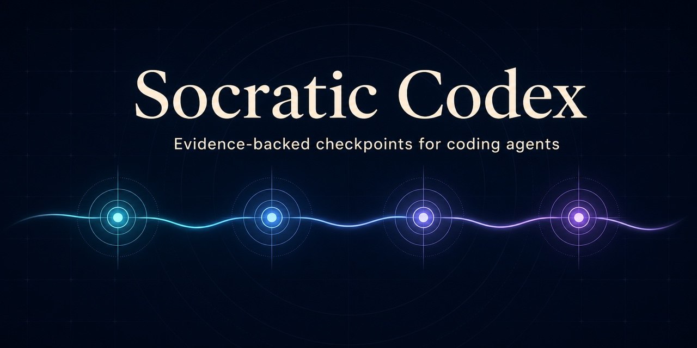

# Socratic Codex



**A compact checkpoint policy for evidence-backed goal alignment in Codex and
Claude Code.**

It adds checkpoints where capable models still benefit from an explicit control
policy: goal drift, consequential boundary changes, stalled diagnosis, and
unsupported completion claims. It continues safe, authorized work until
evidence closes acceptance, the goal is abandoned or superseded, or progress is
genuinely blocked. It delegates state, permissions, context continuity, and
subagent handoff to the host instead of recreating them in hooks.

**中文摘要：** Socratic Codex 是面向高级 coding agent 的紧凑目标校准
skill。它只补强目标漂移、重大边界变化、诊断停滞、过早停止和缺乏证据的
完成声明；只要仍有安全且已授权的动作就继续推进，直到证据完成验收或出现
真实终止条件。状态、权限、上下文连续性与 subagent 交接由宿主原生能力负责，
不再用 hooks 重复实现。

## Quick start

### Codex

```bash
codex plugin marketplace add nshcr/socratic-codex
codex plugin add socratic-codex@socratic-codex
```

Invoke it explicitly:

```text
Use $socratic-codex to carry this goal through evidence-backed acceptance.
Use $socratic-codex to recover this stuck investigation.
Use $socratic-codex to close this request against evidence.
```

Verify installation with `codex plugin marketplace list` and
`codex plugin list`, then restart Codex if needed.

### Claude Code

```bash
claude plugin marketplace add nshcr/socratic-codex
claude plugin install socratic-codex@socratic-codex
```

Invoke `/socratic-codex:socratic-codex` or ask Claude Code to use the skill
explicitly. Verify installation with `claude plugin list`.

**中文摘要：** 建议显式调用该 skill。Codex 默认禁用 implicit invocation，
避免清晰任务被额外的 checkpoint policy 拖慢。上面的命令分别完成 Codex
和 Claude Code 安装；Codex 使用 `$socratic-codex`，Claude Code 使用带插件
命名空间的 `/socratic-codex:socratic-codex`。安装后可用各自的 plugin list
命令确认，Codex 必要时需要重启。

## What it changes

The skill changes action order at four points:

1. **Preserve:** keep only the intended outcome, confirmed boundaries, required
   acceptance evidence, and the next unresolved user-owned choice.
2. **Decide:** inspect first; ask only when the answer changes the next action and
   cannot be derived safely from evidence.
3. **Recover:** after two non-informative attempts, switch from variations to a
   reproducer, falsifiable hypotheses, and a discriminating observation.
4. **Close:** continue safe, authorized work while it can reduce uncertainty or
   satisfy unmet outcomes, then map every requested outcome and confirmed
   constraint to observed evidence before claiming completion.

It prefers the host's native goal, plan, compaction, permission, and subagent
features. It does not create `.socratic/` files, runtime ledgers, audit logs, or
a parallel lifecycle state machine.

**中文摘要：** 它只在四个节点改变行动顺序：保留最小目标状态；先核查再在
真正属于用户的边界提问；两次无信息增益的尝试后切换到可证伪诊断；完成前
逐项用观察证据对照原始请求；只要仍有安全且已授权的下一步，就不能把进度
汇报或回合结束当作停止条件。它复用宿主原生能力，不再创建 `.socratic/`
文件、ledger、audit log 或第二套状态机。

## When to use it

Use it for:

- sustained work whose scope or acceptance can drift;
- corrections such as “this is the wrong direction”;
- repeated failures or contradictory evidence;
- work at risk of stopping after partial progress while safe authorized actions
  remain;
- consequential scope, architecture, side-effect, or irreversible changes;
- final acceptance or a handoff that must distinguish verified from assumed.

Skip it for:

- one deterministic command;
- small mechanical edits with obvious acceptance;
- routine implementation where the request and verification path are already
  clear.

**中文摘要：** 适合容易发生范围或验收漂移的持续任务、用户纠偏、反复失败
或证据矛盾的诊断、仍有安全且已授权动作却可能过早停止的工作、重大边界变化，
以及最终验收或交接。单个确定命令、验收显而易见的小型机械修改和路径清楚的
常规实现不应启用。

## Why there are no hooks

Previous releases bundled `SessionStart`, `UserPromptSubmit`, `PreToolUse`,
`SubagentStart`, `SubagentStop`, and `Stop` hooks. They were removed after a
capability review for newer advanced models:

- keyword matching could not reliably identify an active goal or completion;
- detecting that *a* test command ran could not prove that requested behavior
  was verified;
- destructive-command tables duplicated host permissions while remaining
  incomplete and bypassable;
- persisted lifecycle state could become stale or disagree with the current
  conversation;
- contract injection duplicated native context and subagent handoff;
- every hook added latency, trust surface, host coupling, and false-trigger
  risk.

The useful behavior is semantic and context-dependent, so it belongs in the
skill. A future hook should be added only for an observable host gap with trace
evidence, a deterministic predicate, and a failure mode safer than pass-through.

**中文摘要：** 旧版六类 hooks 已全部移除。它们依赖关键词、命令名和持久化
状态猜测目标与完成情况，无法证明真正的 acceptance，同时重复宿主权限和
上下文能力，并引入延迟、信任面、宿主耦合及误触发。只有当真实 trace 证明
存在宿主缺口、判断条件可确定，且失败模式比直接放行更安全时，才应重新引入
hook。

## Scope and evaluation

Socratic Codex is intentionally narrow and experimental. Advanced models
already know how to inspect code, plan, test, and communicate. The skill is
useful only if it measurably improves decisions at the four checkpoints above.

Evaluate it with paired task traces, not prose quality. Useful measures are:

- goal-changing actions taken without user-owned confirmation;
- questions whose answers did not change the next action;
- third blind attempts in a diagnostic loop;
- premature handoffs while safe authorized actions remained;
- completion claims with uncovered requested outcomes;
- added turns and interruptions on clear routine work.

No benchmark is currently claimed.

**中文摘要：** 该 skill 仍是刻意保持窄范围的实验性能力。新模型并不需要
另一套“如何写代码”的教程；它的价值只能体现在四个 checkpoint 是否改善
真实决策。应使用成对任务 traces 衡量目标越界、无效提问、盲目重试、仍有
安全动作时过早交接、无证据完成声明及对普通任务增加的干扰，目前不声明已有
benchmark。

## Local checkout install

```bash
git clone https://github.com/nshcr/socratic-codex.git
cd socratic-codex
codex plugin marketplace add .
codex plugin add socratic-codex@socratic-codex
```

For Claude Code, use `claude plugin marketplace add .` followed by
`claude plugin install socratic-codex@socratic-codex`.

**中文摘要：** 本地安装时先 clone 并进入仓库，再把当前目录加入对应宿主的
marketplace 并安装 `socratic-codex@socratic-codex`。

## Repository layout

```text
./.agents/plugins/marketplace.json
./.claude-plugin/marketplace.json
plugins/socratic-codex/
  .codex-plugin/plugin.json
  .claude-plugin/plugin.json
  skills/socratic-codex/SKILL.md
  skills/socratic-codex/agents/openai.yaml
```

`SKILL.md` is the only behavioral source of truth. The two manifests package
the same skill for their respective hosts. The plugin currently ships no hooks,
subagent components, MCP servers, or LSP servers.

**中文摘要：** `SKILL.md` 是唯一行为事实源；Codex 与 Claude Code 的 manifest
只负责为各自宿主打包同一份 skill。当前插件没有 hooks、subagent、MCP 或
LSP 运行时组件。
